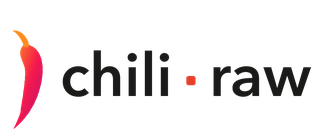

<picture>
  <source media="(prefers-color-scheme: dark)" srcset="assets/wordmark-dark.png">
  
</picture>

### A photo culler, RAW developer, and asset manager, built just for the modern Mac.

**[⬇︎ Download Chili RAW 1.0.0](https://github.com/halebop17/chili-raw-photo-developer/releases/latest)**

<b>macOS 15 Sequoia or later · Apple silicon (M1 or newer)</b> 
<a href="https://github.com/halebop17/chili-raw-photo-developer/releases">Browse all releases</a> ·
<a href="https://github.com/halebop17/chili-raw-photo-developer/wiki">Read the manual</a> ·
<a href="https://github.com/halebop17/chili-raw-photo-developer/issues">Report a problem</a>

`macOS 15+`  `Apple silicon`  `v1.0.0`  `Free to use`  `No account`

 

## About Chili RAW

Chili RAW takes a card full of frames and gets you to finished pictures — cull the shoot,
develop the keepers, and keep your whole library searchable, all in one window and all on
your own disk. It never imports, copies, or uploads a single file.

It runs on Apple silicon and nothing else. The develop pipeline is built on Metal and Core
Image, the AI runs on the Neural Engine, and the interface is native AppKit and SwiftUI
rather than an imitation of one.

If you have used Lightroom or Photomator, everything here will be familiar: a culling
workflow, a non-destructive RAW developer with masks and local adjustments, a searchable
catalog, geotagging, metadata editing and export. **All of that is free** — no account, no
watermark, no time limit, and nothing withheld from it. A Pro licence adds the film
darkroom, the paint canvas, the on-device AI tools and depth-based bokeh.

> **Chili RAW is free to use, but it is not open source.** This repository is where the app
> is distributed and supported — releases, the manual, and issues. The source is not in here.

---

## What it does

### Cull
- Ratings, picks, rejects and colour flags, all from the keyboard.
- Burst **Stacks** — a run of frames collapses into one tile until you open it.
- **Compare** and **Survey** side-by-side modes, with zoom and pan synced across panes.
- A hover **Loupe** showing real pixels under the cursor, with focus peaking.
- An on-device Vision score that puts the likely keepers first.
- A distraction-free Darkroom for judging a frame with nothing else on screen.

### Develop
- **Three RAW decoders you choose between** — Apple CIRAWFilter, the Adobe DNG SDK, and LibRaw with your own DCP profiles — and **three tone mappers** (AgX, Standard, Neutral).
- Compressed DNG, including the JPEG XL compression DNG 1.7 introduced.
- Tone, curves, colour mixing, texture, clarity and a physical dehaze.
- RAW highlight recovery drawn from the file's own headroom.
- **Eleven kinds of mask** that add, subtract and intersect.
- Sky, Object and Depth masks, and portrait editing by face part. *
- Heal, Clone, and cross-frame dust detection.
- **Generative Remove** — paint over an object and the background is rebuilt. *
- **AI denoise**, motion-blur rescue and AI Detail. *
- **Bokeh** — a depth-driven optical blur with a five, six or seven-blade iris. *
- **Lens corrections** from your camera's own tables or the bundled Lensfun database.
- Crop, straighten, perspective, and auto level across a whole selection.
- Multiple **versions** per photo, batch editing with Auto Sync, and **Proof** mode.

### Film Labor *
- Eighteen film stocks and eight papers, each modelled from published datasheets.
- The stages a real frame goes through: exposure onto the negative, halation, grain, the print, and the light you view it under.
- A ring-around that renders your own frame at seven steps either side of where you are.

### Organise
- A searchable catalog with Smart Folders and Collections.
- Search across filenames, IPTC and Vision keywords — or by what is in the picture. *
- **People** — faces detected, grouped and named, entirely on your Mac. *
- Geotagging with **offline** place names: no geocoding service, no network request.
- EXIF/IPTC editing in bulk, written to the file or an XMP sidecar.
- Vault backups to another drive.

### Pixels *
- A layer canvas over the developed photo: type, borders, glowing date stamps, dithered gradient washes, and a Deluxe-Paint palette.
- **Enlarge** — click an object and scale it up in place.

### Export
- JPEG (jpegli), JPEG XL, HEIC, 16-bit TIFF and layered PSD.
- Resize with output sharpening applied to the pixels that actually get written.
- AI upscaling when you are enlarging past the original. *
- Batch renaming, metadata policy, GPS and person-info stripping.

### Video
- Clips sit in the grid with the photos, play full screen, and take a colour grade applied frame by frame on export — HEVC or H.264, in a MOV or MP4.

<i>Features marked with an asterisk (*) require a Pro licence.</i>

---

## Installing

1. Download the `.dmg` from [Releases](https://github.com/halebop17/chili-raw-photo-developer/releases/latest).
2. Drag **Chili RAW** to your Applications folder.
3. Open it.

<!-- TODO: once notarization is in the release pipeline, say so here — until then,
     macOS may ask you to confirm the first launch (right-click ▸ Open). -->

---

## Privacy

- **Your photos stay where they are.** Chili RAW reads folders on your disk. It never imports, copies or moves your originals, and never overwrites your pixels.
- **No account, no telemetry, no analytics, no crash reporting.**
- **The app makes two kinds of network request:** downloading an AI model when you press Download, and a one-time licence activation if you unlock Pro. Nothing else in it talks to the internet — place names come from a table inside the app, and no image ever leaves your Mac.

---

## Chili RAW Pro

You can support development and unlock every feature with a **Pro licence — $29.99, once**.
It is perpetual rather than a subscription: the version you unlock is yours to keep, and
updates are included. Buy it on the website, or inside the app under
`Settings` ▸ `Pro`.

<!-- TODO: point this at the Payhip page once the URL exists. -->
**[Unlock Chili RAW Pro →](#)**

Even without a licence the app stays useful indefinitely: culling, developing, cataloguing,
geotagging and export are free, with no account, no watermark and no time limit. A 7-day
trial is available if you want to evaluate the Pro features before deciding.

---

## Bugs, requests, questions

Open an [issue](https://github.com/halebop17/chili-raw-photo-developer/issues). For anything
that looks like a bug, four things make it fixable in one pass:

- your macOS version and Mac model,
- the camera and file type (`.ARW`, `.CR3`, `.NEF`, `.DNG`, …),
- which RAW decoder you have selected in **Settings ▸ General ▸ RAW decoding**,
- what you expected to see, and what you saw instead.

---

© 2026 <!-- TODO: your name or company -->  ·  Not affiliated with Adobe, Apple, Fujifilm,
Kodak or any other manufacturer named in the app. 
Film and paper names identify the stock being emulated; the emulations are built from
published datasheets and are not replicas.

